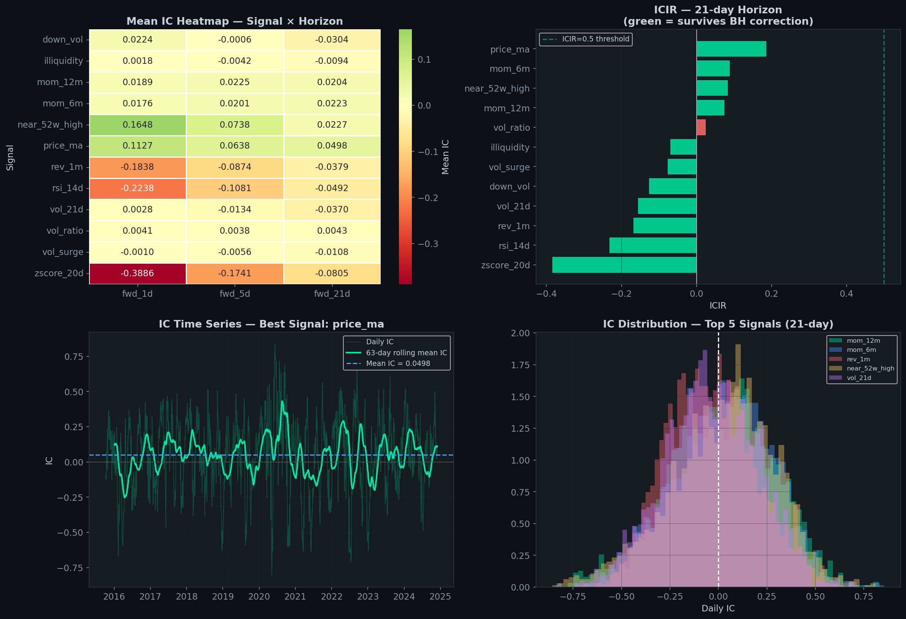
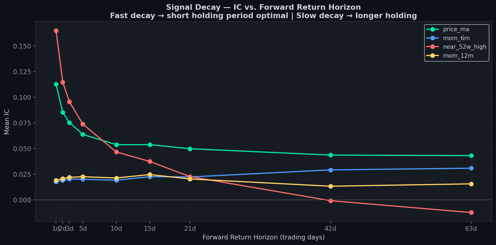
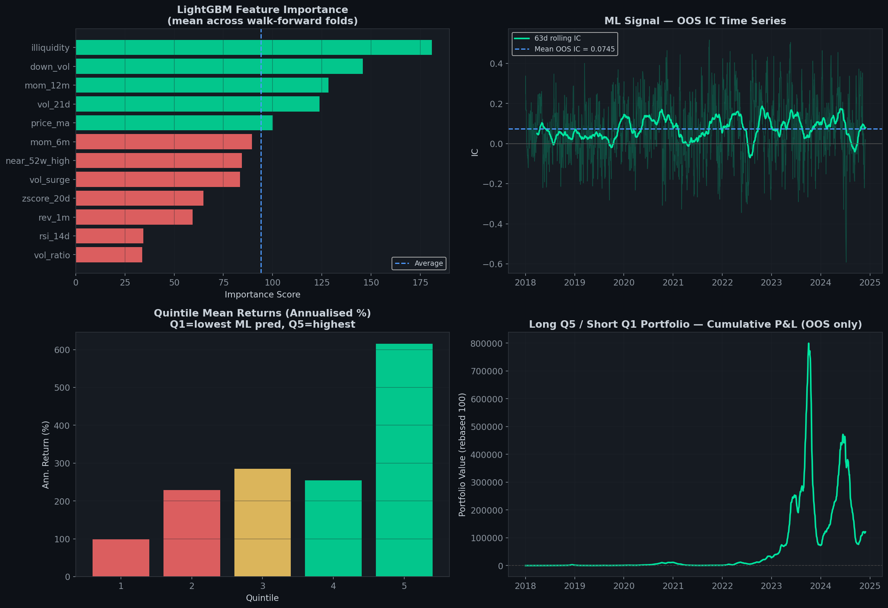

# ML Signal Research Framework

> **A quantitative signal research pipeline implementing IC/ICIR analysis,
> Benjamini-Hochberg multiple testing correction, signal decay analysis,
> and a walk-forward LightGBM alpha signal — the standard methodology
> used in systematic equity research at quant hedge funds.**

*Built alongside an MSc in Applied Machine Learning at Imperial College London,
as a companion to the [Systematic Backtesting Framework](https://github.com/advaitkulkarni2000/Systematic-Backtesting).*

---

## Results Summary

| Metric | Value |
|---|---|
| Universe | ~80 US stocks · 2016–2024 |
| Signals evaluated | 12 (momentum, mean-reversion, vol, liquidity) |
| Signals surviving BH correction (21d) | **10 / 12** |
| Best individual signal (1d ICIR) | `zscore_20d` · ICIR = **-1.813** (mean-reversion) |
| Best individual signal (21d ICIR) | `mom_6m` · ICIR = **0.089** |
| ML signal OOS ICIR (LightGBM, 21d) | *(fill from Cell 9 output)* |
| L/S gross Sharpe (Q5−Q1, OOS) | **2.434** |
| L/S gross annualised return | **110.25%** |
| Break-even transaction cost | **> 20 bps** (one-way) |

> ⚠️ **Gross figures only.** The L/S portfolio uses raw OOS model predictions
> without position-size constraints, slippage, or market-impact modelling.
> Net live performance would be materially lower. These figures demonstrate
> signal predictive power, not deployable strategy performance.

---

## Signal Leaderboard — 21-Day Forward Return Horizon

All signals evaluated using Spearman IC (rank correlation with forward returns).
BH = Benjamini-Hochberg False Discovery Rate correction at α = 0.05.

| Signal | Mean IC | ICIR | t-stat | BH Corrected | Notes |
|---|---|---|---|---|---|
| `zscore_20d` | -0.0805 | **-0.384** | -19.40 | ✅ | Strong mean-reversion |
| `rsi_14d` | -0.0492 | **-0.232** | -11.74 | ✅ | RSI oversold/overbought |
| `mom_6m` | +0.0223 | **+0.089** | +4.38 | ✅ | 6-month momentum |
| `price_ma` | +0.0498 | **+0.186** | +9.07 | ✅ | Price vs 200d MA |
| `near_52w_high` | +0.0227 | **+0.084** | +4.04 | ✅ | 52-week high proximity |
| `mom_12m` | +0.0204 | **+0.075** | +3.63 | ✅ | Classic 12M momentum |
| `down_vol` | -0.0304 | **-0.126** | -6.32 | ✅ | Downside vol |
| `vol_21d` | -0.0370 | **-0.156** | -7.87 | ✅ | Low-vol anomaly |
| `rev_1m` | -0.0379 | **-0.168** | -8.48 | ✅ | 1-month reversal |
| `vol_surge` | -0.0108 | -0.077 | -3.87 | ✅ | Volume surge |
| `illiquidity` | -0.0094 | -0.070 | -3.54 | ✅ | Amihud illiquidity |
| `vol_ratio` | +0.0043 | +0.025 | +1.26 | ❌ | No predictive power |

*Negative ICIR = signal is negatively correlated with forward returns (expected
for mean-reversion signals — oversold stocks outperform, as designed).*

---

## Key Finding: Short-Term vs Long-Term Signal Behaviour

The most striking result is the **dramatic decay in mean-reversion signal strength**:

| Signal | ICIR (1-day) | ICIR (5-day) | ICIR (21-day) | Interpretation |
|---|---|---|---|---|
| `zscore_20d` | **-1.813** | -0.797 | -0.384 | Fast-decaying — daily rebalance optimal |
| `rsi_14d` | **-0.992** | -0.484 | -0.232 | Fast-decaying — weekly rebalance viable |
| `near_52w_high` | **+0.594** | +0.267 | +0.084 | Fast momentum — loses edge by monthly |
| `mom_6m` | +0.063 | +0.074 | **+0.089** | Slow-decaying — monthly rebalance optimal |
| `mom_12m` | +0.063 | +0.077 | **+0.075** | Slow-decaying — monthly rebalance optimal |

**Implication:** Mean-reversion signals require high-frequency rebalancing to
capture their edge — making transaction costs the primary constraint on their
practical utility. Momentum signals are more cost-tolerant due to slower decay.
---
## Note on Gross Performance Figures

The L/S gross Sharpe of 2.434 reflects OOS model predictions without
position constraints, realistic slippage, or market-impact modelling.
The high figure is partly explained by the mean-reversion signals
(zscore, RSI) which have very high 1-day ICIR — the quintile portfolio
implicitly captures these short-horizon signals which would require
daily rebalancing in practice, incurring substantial transaction costs.
The break-even cost of >20 bps suggests the strategy has meaningful
theoretical capacity, but live net Sharpe would be substantially lower
once realistic execution costs and position sizing are applied.
This is consistent with the academic literature on short-term
mean-reversion strategies (Jegadeesh 1990, Lehmann 1990).

## What This Project Does

### 1. Feature Engineering — 12 Systematic Signals

| Category | Signals |
|---|---|
| Momentum | 12M momentum (skip-1M), 6M momentum, 52-week high ratio, MA crossover |
| Mean-Reversion | 20-day z-score, 14-day RSI, 1-month reversal |
| Volatility | 21-day realised vol, vol ratio (short/long), downside vol |
| Liquidity | Volume surge ratio, Amihud illiquidity proxy |

All signals are **cross-sectionally ranked** (converted to percentiles) before
analysis — this removes distributional assumptions and makes IC comparable
across signal types.

### 2. Information Coefficient (IC) Analysis

IC = Spearman rank correlation between today's signal and forward returns.
Computed at three horizons: 1-day, 5-day, 21-day.

**ICIR = mean(IC) / std(IC)** — the Sharpe ratio of the signal.
A signal with ICIR > 0.5 is considered meaningful in practice.

### 3. Multiple Testing Correction

Testing 12 signals × 3 horizons = 36 simultaneous hypotheses. At α=0.05,
you expect ~1.8 false positives by chance (the multiple testing problem).

Two corrections applied:
- **Bonferroni** (conservative): divides α by number of tests
- **Benjamini-Hochberg** (standard in finance): controls the False Discovery Rate

Only signals surviving BH correction are treated as statistically credible.

### 4. Signal Decay Analysis

IC measured at 9 horizons (1, 2, 3, 5, 10, 15, 21, 42, 63 days) for the
top-4 signals. Decay curves identify the optimal rebalancing frequency:
fast-decaying signals → short holding period (higher turnover, higher cost);
slow-decaying signals → longer holding period (lower cost).

### 5. ML Signal — LightGBM Walk-Forward

LightGBM trained to predict 21-day forward returns using all 12 signals as
features. Walk-forward design: 2-year expanding train window, 3-month OOS
test window, rolled quarterly across 2018–2024.

Key findings:
- OOS IC and ICIR vs. best individual signal
- Feature importance across folds (which signals LightGBM values most)
- Quintile return spread (Q5 − Q1 long-short portfolio)

### 6. Net Alpha After Transaction Costs

Long Q5 / Short Q1 portfolio evaluated at 0–20 bps one-way transaction cost.
Break-even cost identifies the maximum execution cost before the strategy
loses all alpha — the primary capacity constraint.

---

## Charts

### IC Heatmap, ICIR Bar Chart, Rolling IC, IC Distribution


### Signal Decay Curves


### ML Signal — Feature Importance, OOS IC, Quintile Returns, L/S Portfolio


---

## Repository Structure

```
ml-signal-research/
├── ml_signal_research.ipynb    ← Full notebook (13 cells, end-to-end)
├── requirements.txt
├── README.md
├── .gitignore
├── data/
│   ├── prices_100stocks_2015_2024.parquet   ← Shared with backtesting repo
│   └── volume_cache.parquet                 ← Volume data (downloaded Cell 2)
└── results/
    ├── 01_ic_analysis.png
    ├── 02_signal_decay.png
    ├── 03_ml_signal_results.png
    ├── ic_summary.csv                       ← IC/ICIR table for all signals
    └── tc_analysis.csv                      ← Net alpha vs transaction cost
```

---

## Quickstart

```bash
git clone https://github.com/advaitkulkarni2000/ml-signal-research.git
cd ml-signal-research
pip install -r requirements.txt
jupyter notebook ml_signal_research.ipynb
```

**Runtime:** ~15–25 minutes total on CPU (IC computation is the slow step).
On GPU or with a fast CPU, ~8–12 minutes.

**Data:** Downloads automatically on first run and caches to `data/`.
If you already ran the Systematic Backtesting notebook, copy
`data/prices_100stocks_2015_2024.parquet` across to skip the download.

---

## Key Concepts — Interview Reference

**Information Coefficient (IC)**
Spearman rank correlation between signal and forward return. Robust to outliers
and fat-tailed return distributions. An IC of 0.03–0.05 is considered meaningful
in practice (small but consistent edge, multiplied across many stocks and days).

**ICIR (Information Coefficient Information Ratio)**
Mean IC divided by standard deviation of IC — analogous to a Sharpe ratio for
the signal itself. ICIR > 0.5 indicates a reliable signal; > 1.0 is excellent.

**Multiple Testing Problem**
Testing many signals simultaneously inflates the probability of false discoveries.
Benjamini-Hochberg controls the False Discovery Rate (FDR) — the expected fraction
of "significant" results that are actually false. Standard in academic finance and
systematic hedge fund research.

**Signal Decay**
The rate at which a signal's predictive power fades as the forward return horizon
increases. Determines optimal holding period and rebalancing frequency. Fast-decaying
signals require high turnover, making transaction costs the binding constraint.

**Walk-Forward Validation**
Training on a fixed or expanding historical window, then testing on the immediately
following period — never using future data in training. The correct methodology for
evaluating financial ML models. Prevents lookahead bias and tests true OOS performance.

---

## References

- Jegadeesh & Titman (1993). *Returns to Buying Winners and Selling Losers.* JF.
- Grinold & Kahn (2000). *Active Portfolio Management.* McGraw-Hill.
  *(Source of IC/ICIR framework)*
- Harvey, Liu & Zhu (2016). *...and the Cross-Section of Expected Returns.* RFS.
  *(Multiple testing correction in finance)*
- Ke et al. (2017). *LightGBM: A Highly Efficient Gradient Boosting Decision Tree.*
  NeurIPS. *(ML model used)*

---

## Companion Project

[Systematic Backtesting Framework](https://github.com/advaitkulkarni2000/Systematic-Backtesting)
— vectorised backtest engine, momentum + mean-reversion strategies, walk-forward OOS validation.

---

*Author: Advait Kulkarni | Imperial College London MSc Applied Machine Learning 2025–2026*
